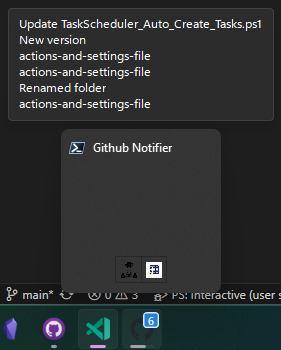

# Desktop_GitHub_Notifier

Opret en taskbar icon som viser dig antallet af notifikationer i GitHub og hvis trykker på ikonet åbner det GitHub i din browser.



## Installation

Du skal installere modulet `PoshTaskbarItem`

```powershell

Install-Module -Name PoshTaskbarItem -Scope CurrentUser

```

Opret en personlig access token med notifications, se guide til oprette en personlig acces token [her](https://docs.github.com/en/enterprise-server@3.6/authentication/keeping-your-account-and-data-secure/managing-your-personal-access-tokens).

Kør scriptet `Setup.ps1` og indtast din personlige access token. Der vil blive oprettet et link i din autostart mappe så scriptet starter når du logger på, samt en genvej i din start menu.

## Links 

- https://mdgrs.hashnode.dev/taskbar-toolmaking-in-powershell